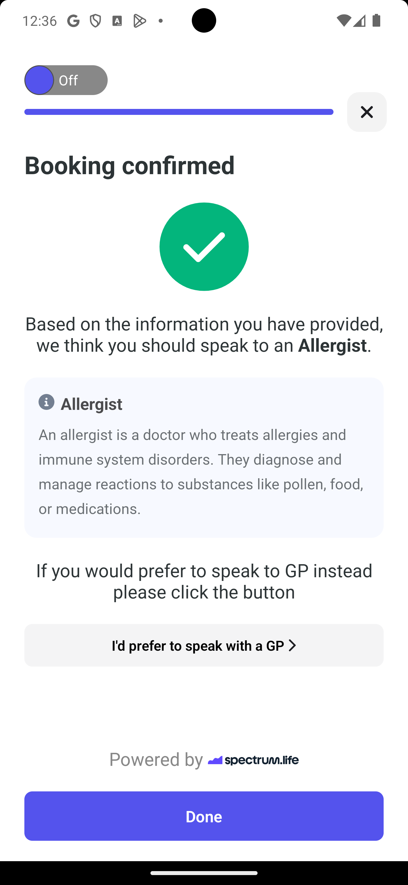

# 📚 Bookin

> A modern React Native app with robust state management, testing, and developer tooling.

---

## 🚀 Tech Stack & Main Libraries

- **[React Native](https://reactnative.dev/):** Core framework for building native apps
- **[TypeScript](https://www.typescriptlang.org/):** Type-safe JavaScript
- **[Jest](https://jestjs.io/)** & **[React Native Testing Library](https://callstack.github.io/react-native-testing-library/):** Testing
- **[Zustand](https://zustand-demo.pmnd.rs/):** Global state management
- **[MMKV](https://github.com/mrousavy/react-native-mmkv):** Key/value storage to persist our zustand store
- **[React Navigation](https://reactnavigation.org/):** Navigation
- **[React Hook Form](https://react-hook-form.com/):** Form validation
- **[React Native Responsive Screen](https://github.com/marudy/react-native-responsive-screen):** Responsive font & dimensions
- **[Lottie React Native](https://github.com/lottie-react-native/lottie-react-native):** Lottie JSON animation (splash screen)

---

## ✨ Features

- 🌍 Localization support
- 🌗 Dark and light mode with dynamic theme rendering
- ✅ Pre-commit linting & testing with Husky
- 📝 Forms are persisted using global state persisted management (Zustand + MMKV)
- 🧪 Unit and snapshot testing for robust code quality
- ⚡ Performance optimization via lazy loading and React memoization techniques
- 🧩 Atomic design code structure using **Atoms**, **Molecules**, **Organisms**, and **Pages**

---

## 🛠️ Git Hooks with Husky

This project uses [Husky](https://typicode.github.io/husky/) to set up git hooks that automatically run linting and testing scripts before committing the source code. This helps ensure code quality and consistency in every commit.

---

## 📄 License

MIT

## 📱 App Demo

---

Check out some screens from the app below:

  
  
  

  
  
  

  
  
  

  

---
